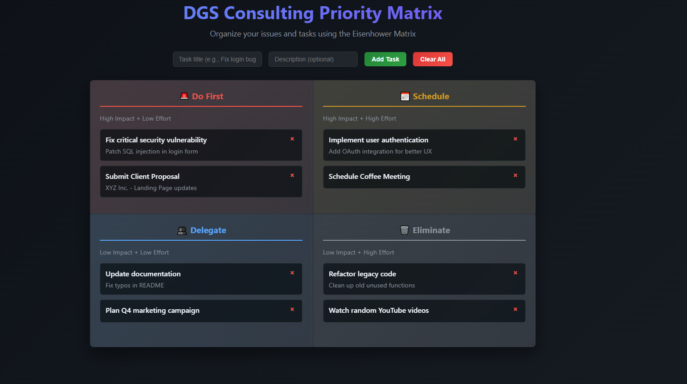

# Priority Matrix Builder

A clean, mobile-friendly Eisenhower Matrix tool to help freelancers and consultants organize tasks by **impact** and **effort**. Stop letting urgent-but-unimportant tasks derail your revenue-generating work.

## 🚀 [Try it Live](https://dgsconsulting.github.io/priority-matrix-builder/) | [Download](https://github.com/DGSConsulting/priority-matrix-builder/releases)



## Quick Start

1. **Download** `dgs-priority-matrix.html` 
2. **Open** in any browser (works offline)
3. **Add tasks** with impact/effort ratings
4. **Focus** on "Do First" quadrant for maximum ROI

No installation, no signup, no complexity.

## How It Works

The Eisenhower Matrix organizes tasks into four actionable quadrants:

| Quadrant | Impact | Effort | Action | Examples |
|----------|--------|--------|---------|----------|
| 🔴 **Do First** | High | Low | Quick wins | Client deliverables, urgent fixes |
| 🟡 **Schedule** | High | High | Plan dedicated time | Major projects, skill development |
| 🔵 **Delegate** | Low | Low | Hand off when possible | Admin tasks, routine maintenance |
| ⚪ **Eliminate** | Low | High | Avoid or minimize | Scope creep, perfectionist tweaks |

## Perfect For

- **Freelancers** managing multiple client priorities
- **Consultants** balancing project demands  
- **Small business owners** optimizing their time
- **Anyone** drowning in "urgent" requests

## Features

- ✅ **Zero Setup** - Single HTML file, works anywhere
- ✅ **Mobile-First** - Manage priorities on the go
- ✅ **Offline Ready** - No internet required
- ✅ **Client-Focused** - Built by freelancers, for freelancers
- ✅ **Visual Organization** - See your priorities at a glance

## Why This Matrix Works for Freelancers

**Stop Revenue Leakage**: Focus on high-impact, low-effort wins that unlock payments and generate testimonials.

**End Decision Fatigue**: Clear visual framework for triaging client requests and internal tasks.

**Scale Intelligently**: Identify what to delegate so you can focus on $200/hour work, not $20/hour tasks.

## Pro Tips

- **Daily Review**: Spend 5 minutes each morning organizing your matrix
- **Client Updates**: Screenshot your "Do First" quadrant for status reports  
- **Boundary Setting**: Use "Eliminate" quadrant to professionally decline scope creep
- **Time Blocking**: Assign specific hours to each quadrant type

## Technical Details

- **File Size**: ~50KB single HTML file
- **Browser Support**: All modern browsers (Chrome, Firefox, Safari, Edge)
- **Dependencies**: None - pure HTML/CSS/JavaScript
- **Storage**: Browser local storage (data persists between sessions)
- **Mobile**: Responsive design, works on all devices

## Customization

The tool is designed to be easily customizable:

```html
<!-- Update colors to match your brand -->
.do-first { border-left-color: #your-brand-color; }

<!-- Rename quadrants for your workflow -->
<h3>Your Custom Label</h3>

<!-- Add your logo -->

```

## Contributing

Found a bug or have a feature idea? 

- 🐛 [Report bugs](https://github.com/DGSConsulting/priority-matrix-builder/issues)
- 💡 [Suggest features](https://github.com/DGSConsulting/priority-matrix-builder/issues)
- 🔧 [Submit pull requests](https://github.com/DGSConsulting/priority-matrix-builder/pulls)

## Roadmap

- [ ] Drag & drop between quadrants
- [ ] Task categories/tags
- [ ] Export to PDF/CSV
- [ ] Time tracking integration
- [ ] Team collaboration features

## Success Stories

*"Finally stopped letting 'quick fixes' derail my big projects. Increased billable hours by 25% in the first month."* - Sarah, Web Developer

*"This matrix helped me identify $10K worth of work I was doing that should have been delegated."* - Mike, Digital Consultant

## License

MIT License - Free for personal and commercial use.

## About DGS Consulting

We're freelancers who got tired of productivity tools that don't understand client chaos. This matrix has saved us thousands of hours and probably our sanity.

**Contact**: [DGSConsult@consultant.com](mailto:DGSConsult@consultant.com) | [LinkedIn](https://linkedin.com/company/dgs-consulting)

---

*Built by freelancers, for freelancers. No fluff, no subscriptions, no complications.*
